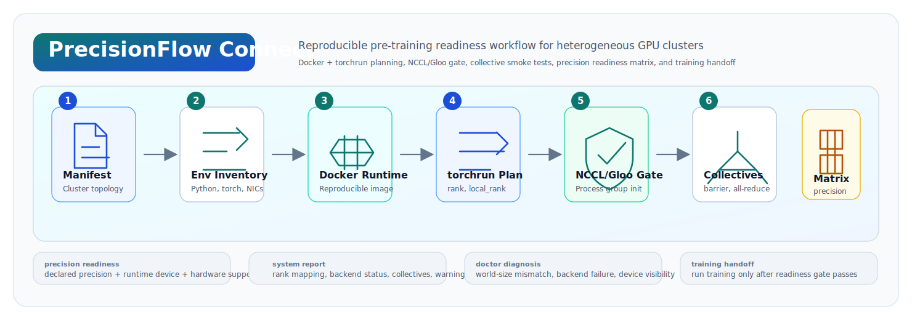

# PrecisionFlow Connect

<p align="center">
  
  
  
  
  
</p>

<h3 align="center">Bring up heterogeneous GPU clusters before training starts.</h3>

PrecisionFlow Connect turns heterogeneous multi-node GPU bring-up into a reproducible pre-training readiness workflow. It checks the infrastructure path that a real distributed AI training job depends on: cluster manifests, rank mapping, device visibility, Docker launch commands, master endpoint, network interfaces, PyTorch distributed backends, collective communication, and a precision readiness matrix for heterogeneous devices.

<p align="center">
  
</p>

## Install

```bash
python -m venv .venv
source .venv/bin/activate
python -m pip install -e .
```

For live distributed runs, install a PyTorch build that matches the target CUDA/NCCL runtime:

```bash
python -m pip install -e ".[torch]"
```

On Windows PowerShell:

```powershell
python -m venv .venv
.\.venv\Scripts\Activate.ps1
python -m pip install -e .
```

## Readiness-Gated Training Launch

PrecisionFlow Connect uses the cluster manifest, node rank, master endpoint, network interface, and training entry point to build one consistent distributed launch plan:

```bash
precisionflow-connect launch configs/multinode_2x4.json \
  --node-rank 0 \
  --master-addr 192.0.2.10 \
  --master-port 29500 \
  --network-interface ib0 \
  --training-script examples/minimal_ddp_train.py -- --epochs 2
```

The launch plan contains the readiness command, the training command, the environment bindings, and the post-run diagnosis command. Add `--execute` to initialize the distributed readiness gate on the current node and start the training script after the gate passes.

Precision declarations in a manifest are part of the readiness contract. PrecisionFlow Connect reconciles each rank's declared precision against the selected runtime device and the hardware-derived support table, then records the result in the report before the training handoff.

## What It Validates

| layer | validation surface |
| --- | --- |
| topology | world size, rank order, node groups, rank-to-machine mapping |
| runtime | `MASTER_ADDR`, `MASTER_PORT`, `RANK`, `LOCAL_RANK`, `WORLD_SIZE`, device visibility |
| network | host interfaces, selected NCCL/Gloo socket interface, master endpoint resolution |
| backend | PyTorch distributed availability, NCCL/Gloo selection, process-group initialization |
| collectives | barrier, all-reduce, all-gather, and per-rank report aggregation |
| precision readiness | declared rank precision, runtime device, hardware-derived support rows |
| launch | Docker command plan, bare-metal `torchrun`, readiness-gated training handoff |

## Quick Start

Inspect the bundled two-node, eight-rank manifest:

```bash
precisionflow-connect inspect configs/multinode_2x4.json
```

Check the local runtime without starting a process group:

```bash
precisionflow-connect connect \
  --manifest configs/multinode_2x4.json \
  --anonymize-hostnames
```

Print Docker and bare-metal commands for every node:

```bash
precisionflow-connect framework configs/multinode_2x4.json \
  --master-addr 192.0.2.10 \
  --master-port 29500 \
  --image precisionflow-connect:gpu \
  --network-interface ib0
```

Generate a readiness-gated training handoff:

```bash
precisionflow-connect launch configs/multinode_2x4.json \
  --node-rank 0 \
  --master-addr 192.0.2.10 \
  --network-interface ib0 \
  --training-script examples/minimal_ddp_train.py -- --epochs 2
```

Run the unit tests:

```bash
python -m unittest discover -s tests
```

## Configure A Cluster Manifest

Create a manifest from node/device shorthand:

```bash
precisionflow-connect configure \
  --job-name hetero-demo \
  --node node-a=cuda:0,cuda:1,cuda:2,cuda:3@bf16 \
  --node node-b=cuda:0,cuda:1,cuda:2,cuda:3@fp16 \
  --output configs/generated_2x4.json
```

The generated manifest records world size, rank-to-machine mapping, rank-to-device mapping, and the desired precision stream per rank:

```json
{
  "job_name": "hetero-demo",
  "world_size": 8,
  "ranks": [
    {"rank": 0, "machine": "node-a", "device": "cuda:0", "precision": "bf16"},
    {"rank": 1, "machine": "node-a", "device": "cuda:1", "precision": "bf16"},
    {"rank": 4, "machine": "node-b", "device": "cuda:0", "precision": "fp16"}
  ]
}
```

## Inspect The Runtime

`env` prints a compact inventory of the current machine:

```bash
precisionflow-connect env --anonymize-hostnames
precisionflow-connect env --json
```

It reports:

- Python executable, version, and platform
- PyTorch installation and CUDA build
- `torch.distributed`, NCCL, and Gloo availability
- CUDA availability and visible device count
- `MASTER_ADDR`, `MASTER_PORT`, `RANK`, `LOCAL_RANK`, `WORLD_SIZE`, and related launch variables
- host interfaces and selected `NCCL_SOCKET_IFNAME` / `GLOO_SOCKET_IFNAME`
- precision readiness rows for `fp32`, `tf32`, `fp16`, `bf16`, `fp8`, and `int8`

## Local Distributed Self-Test

When PyTorch is installed, run a local two-process Gloo smoke test:

```bash
precisionflow-connect self-test --nproc-per-node 2 --backend gloo
```

To preview the command:

```bash
precisionflow-connect self-test --dry-run
```

The default self-test starts local subprocesses with the same `MASTER_ADDR`, `MASTER_PORT`, `RANK`, `LOCAL_RANK`, and `WORLD_SIZE` contract that `torchrun` provides. It writes:

```text
reports/self-test/connect.json
reports/self-test/connect.md
```

To preview the `torch.distributed.run` launcher form:

```bash
precisionflow-connect self-test --launcher torchrun --dry-run
```

## Verification Matrix

| surface | command or evidence | status |
| --- | --- | --- |
| unit tests | `python -m unittest discover -s tests` | local CI-ready |
| manifest validation | `precisionflow-connect inspect configs/multinode_2x4.json` | no PyTorch required |
| local runtime inventory | `precisionflow-connect env` | no PyTorch required |
| local Gloo smoke test | `precisionflow-connect self-test --backend gloo` | local multi-process readiness gate path |
| Docker CPU bring-up | `docker compose -f docker/compose.2node.gloo.yml up --abort-on-container-exit` | reproducible container path |
| NCCL multi-node gate | `torchrun ... -m precisionflow_lab connect --live --backend auto` | run on target GPU cluster |
| training handoff | `precisionflow-connect launch ... --training-script train.py` | readiness gate runs before training |

## Docker Runtime

Build a CPU image for local checks:

```bash
docker build -f docker/Dockerfile -t precisionflow-connect:cpu .
```

Build a GPU image from a cluster-approved PyTorch/CUDA base image:

```bash
docker build -f docker/Dockerfile \
  --build-arg BASE_IMAGE=<cluster-approved-pytorch-cuda-image> \
  -t precisionflow-connect:gpu .
```

Run the local two-container Gloo example:

```bash
docker compose -f docker/compose.2node.gloo.yml up --abort-on-container-exit
```

Generate per-node Docker commands:

```bash
precisionflow-connect framework configs/multinode_2x4.json \
  --master-addr 192.0.2.10 \
  --master-port 29500 \
  --image precisionflow-connect:gpu \
  --network-interface ib0
```

Example Docker command shape:

```bash
docker run --rm --network host --ipc host --gpus all \
  -v $PWD:/workspace -w /workspace \
  -e NCCL_DEBUG=INFO \
  -e NCCL_SOCKET_IFNAME=ib0 \
  -e GLOO_SOCKET_IFNAME=ib0 \
  -e CUDA_VISIBLE_DEVICES=0,1,2,3 \
  precisionflow-connect:gpu \
  torchrun --nnodes=2 --nproc_per_node=4 --node_rank=0 \
    --master_addr=192.0.2.10 --master_port=29500 \
    -m precisionflow_lab connect --live --backend auto \
    --manifest configs/multinode_2x4.json \
    --json-output reports/connect.json \
    --markdown-output reports/connect.md
```

## Live Multi-Node Readiness Gate

Run the same `torchrun` topology that the training job will use. Replace `192.0.2.10` with the rank-0 host address on the training network.

Rank-0 node:

```bash
torchrun --nnodes=2 --nproc_per_node=4 --node_rank=0 \
  --master_addr=192.0.2.10 --master_port=29500 \
  -m precisionflow_lab connect --live --backend auto \
  --manifest configs/multinode_2x4.json \
  --anonymize-hostnames \
  --markdown-output reports/connect.md \
  --json-output reports/connect.json
```

Rank-1 node:

```bash
torchrun --nnodes=2 --nproc_per_node=4 --node_rank=1 \
  --master_addr=192.0.2.10 --master_port=29500 \
  -m precisionflow_lab connect --live --backend auto \
  --manifest configs/multinode_2x4.json \
  --anonymize-hostnames
```

Only rank 0 writes the aggregate report. When a host has multiple NICs, bind the intended training network:

```bash
export NCCL_SOCKET_IFNAME=ib0
export GLOO_SOCKET_IFNAME=ib0
```

## Training Handoff

The bundled `examples/minimal_ddp_train.py` is a small PyTorch DDP script that can be launched behind the readiness gate:

```bash
precisionflow-connect launch configs/multinode_2x4.json \
  --node-rank 0 \
  --master-addr 192.0.2.10 \
  --network-interface ib0 \
  --training-script examples/minimal_ddp_train.py -- --epochs 2
```

For a real training script, keep the same manifest, master endpoint, node rank, and network interface, then replace the script path and arguments:

```bash
precisionflow-connect launch configs/multinode_2x4.json \
  --node-rank 0 \
  --master-addr 192.0.2.10 \
  --network-interface ib0 \
  --training-script train.py -- --config configs/train.yaml
```

Run with `--execute` on each node after checking the generated commands:

```bash
precisionflow-connect launch configs/multinode_2x4.json \
  --node-rank 0 \
  --master-addr 192.0.2.10 \
  --network-interface ib0 \
  --training-script examples/minimal_ddp_train.py \
  --execute -- --epochs 2
```

## Example System Report

```text
# PrecisionFlow Connect System Report

- Mode: live
- Overall status: PASS
- Declared world size: 8
- Backend: nccl
- Master endpoint: 192.0.2.10:29500

## Rank Mapping

| rank | host | local rank | runtime device | backend |
| --- | --- | --- | --- | --- |
| 0 | node-a | 0 | cuda:0 | nccl |
| 1 | node-a | 1 | cuda:1 | nccl |
| 2 | node-a | 2 | cuda:2 | nccl |
| 3 | node-a | 3 | cuda:3 | nccl |
| 4 | node-b | 0 | cuda:0 | nccl |
| 5 | node-b | 1 | cuda:1 | nccl |
| 6 | node-b | 2 | cuda:2 | nccl |
| 7 | node-b | 3 | cuda:3 | nccl |

## Backend Status

| backend | status | detail |
| --- | --- | --- |
| nccl | PASS | NCCL backend initialized successfully across 8 ranks |

## Network

| item | value |
| --- | --- |
| master endpoint | 192.0.2.10:29500 |
| NCCL_SOCKET_IFNAME | ib0 |
| GLOO_SOCKET_IFNAME | ib0 |

## Precision Readiness Matrix

| host | device | name | fp32 | tf32 | fp16 | bf16 | fp8 | int8 |
| --- | --- | --- | --- | --- | --- | --- | --- | --- |
| node-a | cuda:0 | NVIDIA A100-SXM4-40GB | yes | yes | yes | yes | no | yes |
| node-a | cuda:1 | NVIDIA A100-SXM4-40GB | yes | yes | yes | yes | no | yes |
| node-b | cuda:0 | NVIDIA H100-SXM5-80GB | yes | yes | yes | yes | yes | yes |
| node-b | cuda:1 | NVIDIA H100-SXM5-80GB | yes | yes | yes | yes | yes | yes |

## Collective Tests

| test | status | detail |
| --- | --- | --- |
| barrier | PASS | all ranks entered and exited barrier |
| all_reduce | PASS | sum expected 36, rank 0 observed 36 |
| all_gather | PASS | gathered ranks [0, 1, 2, 3, 4, 5, 6, 7] |

## Diagnosis

- multi-node communication passed
- collective communication smoke test passed
- rank-to-machine/device mapping captured on rank 0
```

## Diagnose A Failed Report

```bash
precisionflow-connect doctor examples/failure_report.json
```

Example output:

```text
| severity | code | area | recommendation |
| --- | --- | --- | --- |
| ERROR | WORLD_SIZE_MISMATCH | rank mapping | Make torchrun --nnodes * --nproc_per_node equal the manifest world_size, or update the manifest. |
| ERROR | BACKEND_INIT_FAILED | backend | Check backend choice, CUDA visibility, PyTorch distributed support, and network binding. |
| WARN | CUDA_DEVICE_NOT_VISIBLE | precision readiness | Check CUDA_VISIBLE_DEVICES, driver/runtime installation, and whether the process is on a GPU node. |
```

## Command Reference

| command | purpose |
| --- | --- |
| `precisionflow-connect configure` | build a manifest from machine/device shorthand |
| `precisionflow-connect inspect` | validate a manifest and print rank, machine, device, and precision streams |
| `precisionflow-connect env` | print local Python, PyTorch, backend, CUDA, network, env, and precision inventory |
| `precisionflow-connect connect` | run preflight checks, or live distributed collectives with `--live` |
| `precisionflow-connect self-test` | run a local multi-process Gloo/NCCL smoke test |
| `precisionflow-connect framework` | render per-node Docker and bare-metal `torchrun` commands |
| `precisionflow-connect launch` | generate or execute a readiness-gated training handoff |
| `precisionflow-connect doctor` | diagnose a generated JSON report |
| `precisionflow-connect profile` | print the framework capability profile |

## Project Layout

```text
configs/                         cluster manifests
docker/                          Dockerfile and Docker Compose templates
examples/                        failure report and minimal DDP handoff example
scripts/                         local helper scripts
src/precisionflow_lab/            CLI, manifest configuration, runtime probes, launcher, diagnosis, reporting
tests/                            unit tests for manifest, framework, runtime, CLI, launcher, environment, and diagnosis
```
